# 🤖 GST/TDS Compliance Validator - Agentic AI System

## 📋 Project Overview

An **Agentic AI-powered invoice compliance validation system** that leverages multiple Large Language Models (LLMs) and specialized AI agents to automate GST and TDS compliance checks for Indian businesses. The system uses intelligent document analysis, rule-based validation, conflict resolution, and comprehensive reporting to ensure regulatory compliance.

### Key Features

✅ **Multi-Agent Architecture** - Four specialized AI agents working in orchestration  
✅ **Multi-LLM Support** - Configurable LLM providers (OpenAI, GROQ, DeepSeek, Grok)  
✅ **OCR & Vision Analysis** - GPT-4o vision for document extraction  
✅ **45-Point Compliance Validation** - Comprehensive GST/TDS validation checklist  
✅ **Intelligent Conflict Resolution** - Handles regulatory conflicts and edge cases  
✅ **Real-time Dashboard** - React-based UI for monitoring and management  
✅ **External API Integration** - Mock GST Portal for live verification  

---

## 🏗️ System Architecture

### High-Level Architecture

```mermaid
graph TB
    subgraph "Frontend Layer"
        UI[React Dashboard<br/>Vite + React]
        Upload[Invoice Upload]
        Dashboard[Compliance Dashboard]
        Reports[Report Viewer]
        Settings[LLM Settings]
    end
    
    subgraph "Backend Layer - FastAPI"
        API[REST API<br/>FastAPI]
        
        subgraph "AI Agent Orchestra"
            E[🔍 Extractor Agent<br/>GPT-4o Vision]
            V[✅ Validator Agent<br/>LLM-based]
            R[🔧 Resolver Agent<br/>Conflict Resolution]
            Rep[📊 Reporter Agent<br/>LLM Report Gen]
        end
        
        LLM[LLM Client Factory<br/>OpenAI/GROQ/DeepSeek/Grok]
    end
    
    subgraph "Data Layer"
        DB[(PostgreSQL<br/>Database)]
        FS[File Storage<br/>uploads/]
    end
    
    subgraph "External Services"
        GST[Mock GST Portal<br/>Flask Server]
    end
    
    UI --> API
    Upload --> API
    Dashboard --> API
    Reports --> API
    Settings --> API
    
    API --> E
    E --> V
    V --> R
    R --> Rep
    
    E --> LLM
    V --> LLM
    R --> LLM
    Rep --> LLM
    
    V --> GST
    
    API --> DB
    API --> FS
    
    style E fill:#4CAF50,color:#fff
    style V fill:#2196F3,color:#fff
    style R fill:#FF9800,color:#fff
    style Rep fill:#9C27B0,color:#fff
    style LLM fill:#F44336,color:#fff
```



### Technology Stack

| Layer | Technology | Purpose |
|-------|-----------|---------|
| **Frontend** | React + Vite | Interactive UI dashboard |
| **Backend** | FastAPI (Python) | RESTful API server |
| **Database** | PostgreSQL | Persistent data storage |
| **AI/ML** | OpenAI GPT-4o, GROQ, DeepSeek, Grok | Multi-LLM processing |
| **Document Processing** | PyMuPDF, OpenAI Vision | PDF/Image extraction |
| **External Integration** | Mock GST Server (Flask) | GST Portal simulation |

---

## 🤖 AI Agents in Detail

### Agent Workflow


### 1️⃣ Extractor Agent

**Purpose**: Analyze uploaded invoices and extract structured GST/TDS data

**AI Model**: OpenAI GPT-4o with Vision capabilities

**Key Capabilities**:
- ✅ PDF to image conversion (PyMuPDF)
- ✅ Multi-format support (PDF, PNG, JPG, JPEG)
- ✅ Vision-based OCR and field extraction
- ✅ Document type classification
- ✅ GSTIN validation and formatting
- ✅ Confidence scoring
- ✅ Rejection of non-invoice images (selfies, random images)

**Extracted Fields**:
```json
{
  "invoice_number": "INV-2024-001",
  "invoice_date": "2024-01-15",
  "seller_name": "ABC Pvt Ltd",
  "seller_gstin": "27AABCT1234L1Z5",
  "buyer_gstin": "27AABCF9999K1ZX",
  "hsn_codes": ["998314"],
  "taxable_amount": 100000,
  "cgst_amount": 9000,
  "sgst_amount": 9000,
  "total_amount": 118000,
  "irn": "64-char-hash...",
  "items": [...]
}
```

**Decision Logic**:
- ✅ **ACCEPT**: Valid GST invoice with seller GSTIN, confidence > 0.6
- ❌ **REJECT**: Missing GSTIN, wrong document type, low confidence, non-document images

**Code Location**: [`compliance-backend/app/services/extractor.py`](compliance-backend/app/services/extractor.py)

---

### 2️⃣ Validator Agent

**Purpose**: Perform 45-point compliance validation using LLM reasoning

**AI Model**: Configurable LLM (GPT-4o / GROQ / DeepSeek / Grok)

**Validation Categories**:


**External API Integration**:
- 🌐 **GST Portal API**: GSTIN validation, HSN rate lookup, e-invoice eligibility
- 📡 **Mock Server**: [compliance-backend/../mock_gst_server](compliance-backend/../mock_gst_server)

**LLM Prompt Strategy**:
```python
# System prompt with expert context
You are a GST/TDS compliance validator for India.
- Classify services correctly (IT=2%, Professional=10%)
- Apply historical GST rate changes
- Detect anomalies and suspicious patterns
- Provide clear, actionable reasons
```

**Output Format**:
```json
{
  "overall_decision": "APPROVE|REJECT|REVIEW",
  "compliance_score": 85,
  "passed_count": 38,
  "failed_checks": [
    {
      "code": "GST-002",
      "name": "GSTIN Status",
      "status": "FAILED",
      "reason": "GSTIN is suspended",
      "auto_reject": true
    }
  ],
  "human_intervention": {
    "required": true,
    "approval_level": "Manager",
    "reasons": ["GSTIN suspended - verify with vendor"]
  }
}
```

**Code Location**: [`compliance-backend/app/services/validator.py`](compliance-backend/app/services/validator.py)

---

### 3️⃣ Resolver Agent

**Purpose**: Handle conflicts, OCR errors, temporal rules, and edge cases

**AI Model**: OpenAI GPT-4o

**Key Capabilities**:

1. **OCR Error Correction**
   - 🔄 O ↔ 0, I ↔ 1, S ↔ 5, B ↔ 8 swaps
   - 🔍 Truncated GSTIN detection
   - 💰 Missing decimal points in amounts

2. **Conflict Resolution**
   - ⚖️ GST vs TDS conflicts (e.g., Rent TDS includes GST)
   - 🔀 IT services classification (2% vs 10% TDS)
   - 📋 206AB vs Lower Deduction Certificate
   - 🚚 GTA RCM applicability

3. **Temporal Rule Application**
   - 📅 Apply rules based on invoice date, not processing date
   - 📊 Historical GST rate changes
   - 🔄 TDS rate changes (Finance Act 2020)
   - 🗓️ FY transition handling

4. **Stateful Validation**
   - 💰 Aggregate TDS threshold tracking
   - 🔁 Duplicate invoice detection
   - 📈 Sequential invoice number validation

5. **Historical Analysis**
   - 🔍 Detect bad precedents (15% incorrect cases)
   - ⚠️ Flag suspicious patterns
   - 📋 Deviation from historical decisions

**Decision Flow**:


**Code Location**: [`compliance-backend/app/services/resolver.py`](compliance-backend/app/services/resolver.py)

---

### 4️⃣ Reporter Agent

**Purpose**: Generate comprehensive, actionable compliance reports

**AI Model**: Configurable LLM (GPT-4o / GROQ / DeepSeek / Grok)

**Report Types**:

| Report Type | Audience | Content |
|------------|----------|---------|
| **Executive Summary** | CFO/Directors | Pass/fail, risk score, action items |
| **Detailed Audit** | Compliance Team | All checks, reasoning, evidence |
| **Exception Report** | Accounts Payable | Failed invoices, resolution steps |
| **Batch Summary** | Management | Aggregate stats, trends |

**Generated Sections**:
- 📊 Executive Summary (2-3 sentences)
- ✅ Decision (APPROVE/REJECT/REVIEW) with confidence
- 🎯 Risk Assessment (LOW/MEDIUM/HIGH/CRITICAL)
- 📈 Compliance Stats (GST/TDS breakdown)
- 🚨 Action Items (prioritized with owners and deadlines)
- 🔍 Key Findings (with impact and recommendations)
- 💡 Recommendations (regulatory citations)
- 👤 Approval Workflow (escalation requirements)

**Sample Report**:
```
📊 COMPLIANCE REPORT - RPT-2024-001
━━━━━━━━━━━━━━━━━━━━━━━━━━━━━━━━━━━━
Decision: ⚠️ REQUIRES REVIEW
Confidence: 65%
Risk Level: MEDIUM

📋 Quick Stats:
• 45 checks run | 38 passed | 5 failed | 2 warnings
• GST Compliance: 85%
• TDS Compliance: 70%

🚨 Action Required:
1. Verify GSTIN validity with vendor (AP Team - 24 hrs)
2. Confirm TDS rate for IT services (Tax Team - 48 hrs)
3. Escalate to Manager for approval (>₹50K)
```

**Code Location**: [`compliance-backend/app/services/reporter.py`](compliance-backend/app/services/reporter.py)

---

## 🧠 LLM Provider Configuration

### Multi-LLM Support

The system supports **4 LLM providers** through a unified client factory:


### Provider Configuration

**Environment Variables** (`.env`):
```bash
# LLM API Keys
OPENAI_API_KEY=sk-...
GROQ_API_KEY=gsk_...
DEEPSEEK_API_KEY=sk-...
GROK_API_KEY=xai-...

# Default Provider (configurable via Settings UI)
DEFAULT_LLM_PROVIDER=groq
```

### Model Mapping

| Provider | Model Name | Use Case | Speed | Cost |
|----------|-----------|----------|-------|------|
| **OpenAI** | `gpt-4o` | High accuracy, vision support | Medium | High |
| **GROQ** | `llama-3.3-70b-versatile` | Fast inference, cost-effective | **Fast** | Low |
| **DeepSeek** | `deepseek-chat` | Alternative reasoning | Medium | Medium |
| **Grok** | `grok-beta` | X.AI's latest model | Medium | Medium |

**Code Location**: [`compliance-backend/app/services/llm_client.py`](compliance-backend/app/services/llm_client.py)

### Dynamic Provider Selection

```python
# Global provider switching
from app.services.llm_client import set_llm_provider, get_llm_client

# Set provider (from frontend Settings page)
set_llm_provider("groq")

# Get client automatically uses configured provider
client = get_llm_client()
model = get_model_name()  # Returns "llama-3.3-70b-versatile"

# All agents use the same pattern
response = client.chat.completions.create(
    model=model,
    messages=[...],
    response_format={"type": "json_object"}
)
```

### Agent-Specific Model Usage

| Agent | Primary Model | Fallback | Reason |
|-------|--------------|----------|--------|
| **Extractor** | OpenAI GPT-4o | ❌ None | Requires vision capabilities |
| **Validator** | Configurable | OpenAI | User can select in Settings |
| **Resolver** | OpenAI GPT-4o | ❌ None | Uses hardcoded OpenAI |
| **Reporter** | Configurable | OpenAI | User can select in Settings |

> **Note**: Currently, **Extractor** and **Resolver** use OpenAI exclusively due to vision requirements and prompt complexity. **Validator** and **Reporter** support all 4 providers via the client factory.

---

## 🗄️ Database Schema

### Entity Relationship Diagram


### Key Tables

#### 1. `uploads`
Stores uploaded invoice files and all agent results

**Important Columns**:
- `extraction_result` (JSON): Output from Extractor Agent
- `validation_result` (JSON): Output from Validator Agent
- `resolver_result` (JSON): Output from Resolver Agent
- `reporter_result` (JSON): Output from Reporter Agent
- `invoice_status`: APPROVED, REJECTED, REQUIRES_REVIEW
- `processing_status`: PENDING, PROCESSING, COMPLETED, FAILED

#### 2. `validation_checklist`
Master table of 45 compliance validation rules

**Sample Records**:
```sql
INSERT INTO validation_checklist VALUES
(1, 'GST-001', 'GSTIN Format Valid', 'GST', 'Format', 
 '15 chars, pattern: ##XXXXX####X#ZX', 'REGEX CHECK', 
 'Invalid GSTIN format', 'SIMPLE', true, false, 10, true),
 
(2, 'TDS-003', '194J Classification', 'TDS', 'Rate', 
 'IT services = 2%, Professional = 10%', 'LLM CLASSIFICATION',
 'Incorrect TDS rate for service type', 'COMPLEX', false, true, 15, true);
```

#### 3. `users`
User authentication and role-based access

**Roles**: ADMIN, MANAGER, REVIEWER, VIEWER

---

## 🔌 API Endpoints

### Backend API (FastAPI)

**Base URL**: `http://localhost:8000/api/v1`

#### Upload & Processing

| Method | Endpoint | Description |
|--------|----------|-------------|
| `POST` | `/uploads/` | Upload invoice file |
| `GET` | `/uploads/{id}` | Get upload details |
| `POST` | `/extraction/{id}` | Run Extractor Agent |
| `POST` | `/validation/{id}` | Run Validator Agent |
| `POST` | `/resolver/{id}` | Run Resolver Agent |
| `POST` | `/reporter/{id}` | Generate report |
| `POST` | `/process-all/{id}` | Run all agents sequentially |

#### Invoices & Reports

| Method | Endpoint | Description |
|--------|----------|-------------|
| `GET` | `/invoices/` | List all invoices |
| `GET` | `/invoices/{id}` | Get invoice details |
| `GET` | `/invoices/{id}/report` | Download report (PDF/JSON) |
| `GET` | `/dashboard/stats` | Dashboard statistics |

#### Validation Checklist

| Method | Endpoint | Description |
|--------|----------|-------------|
| `GET` | `/validation-checklist/` | Get all 45 checks |
| `GET` | `/validation-checklist/{code}` | Get specific check |

#### LLM Settings

| Method | Endpoint | Description |
|--------|----------|-------------|
| `GET` | `/settings/llm` | Get current LLM config |
| `PUT` | `/settings/llm` | Update LLM provider |
| `GET` | `/settings/llm/providers` | Get available providers |

**API Documentation**: Available at `http://localhost:8000/docs` (Swagger UI)

---

## 🎨 Frontend Architecture

### Component Structure

```
compliance-validator-agent/src/
├── components/
│   ├── Dashboard.jsx          # Main dashboard with stats
│   ├── Invoices.jsx           # Invoice list with filters
│   ├── ComplianceReports.jsx  # Report viewer
│   ├── AgentCenter.jsx        # Agent execution panel
│   ├── Settings.jsx           # LLM provider configuration
│   ├── Sidebar.jsx            # Navigation
│   └── ExtractionModal.jsx    # Extraction results modal
├── services/
│   ├── uploadService.js       # File upload API
│   ├── extractionService.js   # Extractor Agent API
│   ├── validationService.js   # Validator Agent API
│   ├── reportService.js       # Reporter Agent API
│   └── settingsService.js     # Settings API
└── App.jsx
```

### Key Features

#### Dashboard
- 📊 Real-time statistics (total invoices, approved, rejected, pending)
- 📈 Compliance score trends
- 🔔 Recent activity feed
- 🎯 Quick actions

#### Invoices Page
- 📋 Filterable invoice list (by status, date range)
- 🔍 Search by invoice number, vendor
- 📄 View extraction results
- ▶️ Run agents individually or in sequence
- 📊 View/download reports

#### Agent Center
- 🤖 Manual agent execution
- 📊 Real-time progress tracking
- 📋 View agent outputs (JSON)
- 🔄 Retry failed executions

#### Settings
- 🔧 Select LLM provider (OpenAI, GROQ, DeepSeek, Grok)
- 🔑 API key configuration guidance
- ℹ️ Provider info (model name, status)

---

## 🚀 Installation & Setup

### Prerequisites

- Python 3.9+
- Node.js 16+
- PostgreSQL 14+
- OpenAI/GROQ/DeepSeek/Grok API keys

### Backend Setup

```bash
# Navigate to backend
cd compliance-backend

# Create virtual environment
python3 -m venv venv
source venv/bin/activate  # On Windows: venv\Scripts\activate

# Install dependencies
pip install -r requirements.txt

# Configure environment
cp .env.example .env
# Edit .env with your database and API keys

# Run database migrations
alembic upgrade head

# Seed validation checklist
python -c "from app.db.seed import seed_validation_checklist; seed_validation_checklist()"

# Start server
uvicorn app.main:app --reload --port 8000
```

### Frontend Setup

```bash
# Navigate to frontend
cd compliance-validator-agent

# Install dependencies
npm install

# Start development server
npm run dev
```

### Mock GST Server (Optional)

```bash
# Navigate to mock server
cd mock_gst_server

# Install dependencies
pip install -r requirements.txt

# Run server
python app.py
```

**Access Points**:
- Backend API: http://localhost:8000
- Frontend: http://localhost:5173
- Mock GST Server: http://localhost:8080
- Swagger Docs: http://localhost:8000/docs

---

## 🔄 Complete Workflow

### End-to-End Processing Flow

```mermaid
flowchart TD
    Start([User Uploads Invoice]) --> Upload[Save to uploads/]
    Upload --> DB1[(Save to DB<br/>status: PENDING)]
    
    DB1 --> Extract[🔍 Extractor Agent<br/>GPT-4o Vision]
    Extract --> ExtractDecision{Valid<br/>Invoice?}
    
    ExtractDecision -->|REJECT| Reject1[Mark as REJECTED<br/>Save reason]
    ExtractDecision -->|ACCEPT| DB2[(Save extraction_result)]
    
    DB2 --> Validate[✅ Validator Agent<br/>45 Point Check]
    Validate --> GST[Mock GST API<br/>GSTIN/HSN verification]
    GST --> ValidateDecision{Compliance<br/>Score?}
    
    ValidateDecision -->|Score >= 95%<br/>Amount <= 50K| AutoApprove[AUTO-APPROVE]
    ValidateDecision -->|Score < 70%<br/>Auto-reject checks| Reject2[REJECT]
    ValidateDecision -->|70% <= Score < 95%| DB3[(Save validation_result)]
    
    DB3 --> Resolve[🔧 Resolver Agent<br/>Conflict Resolution]
    Resolve --> ResolveDecision{Confidence?}
    
    ResolveDecision -->|>= 70%| Decide{Final<br/>Decision?}
    ResolveDecision -->|< 70%| HumanReview[ESCALATE<br/>Human Review]
    
    Decide -->|APPROVE| Approve[Mark APPROVED]
    Decide -->|REJECT| Reject3[Mark REJECTED]
    Decide -->|REVIEW| HumanReview
    
    Approve --> DB4[(Save resolver_result)]
    Reject2 --> DB4
    Reject3 --> DB4
    HumanReview --> DB4
    
    DB4 --> Report[📊 Reporter Agent<br/>Generate Report]
    Report --> DB5[(Save reporter_result<br/>status: COMPLETED)]
    
    DB5 --> End([Report Available])
    Reject1 --> End
    AutoApprove --> Report
    
    style Extract fill:#4CAF50,color:#fff
    style Validate fill:#2196F3,color:#fff
    style Resolve fill:#FF9800,color:#fff
    style Report fill:#9C27B0,color:#fff
    style AutoApprove fill:#4CAF50,color:#fff
    style Reject1 fill:#F44336,color:#fff
    style Reject2 fill:#F44336,color:#fff
    style Reject3 fill:#F44336,color:#fff
    style HumanReview fill:#FFC107,color:#000
```



---

## 📊 Dashboard Statistics

### Data Flow for Dashboard


---

## 🎯 Compliance Validation Examples

### Example 1: Valid Invoice (Auto-Approved)

**Input**:
- Invoice Amount: ₹45,000
- Seller GSTIN: 27AABCT1234L1Z5 (Active)
- HSN: 998314 (IT Services)
- GST Rate: 18% (Correct)
- TDS Section: 194J @ 2% (Correct for IT)

**Agent Results**:
- ✅ Extractor: ACCEPT (confidence 0.92)
- ✅ Validator: APPROVE (compliance score 98%)
- ✅ Resolver: APPROVE (confidence 0.95, no conflicts)
- ✅ Reporter: Executive summary generated

**Final Decision**: **AUTO-APPROVED** (Amount ≤ ₹50K, Score ≥ 95%)

### Example 2: Failed Validation (Rejected)

**Input**:
- Invoice Amount: ₹2,00,000
- Seller GSTIN: 27XXXXX9999X1ZX (**Suspended**)
- GST Rate: 12% (Should be 18%)
- TDS: Not deducted (Threshold crossed)

**Agent Results**:
- ✅ Extractor: ACCEPT
- ❌ Validator: REJECT (compliance score 55%)
  - Failed: GST-002 (GSTIN suspended) [AUTO-REJECT]
  - Failed: GST-005 (Wrong GST rate)
  - Failed: TDS-001 (TDS not deducted)
- 🔧 Resolver: REJECT (OCR corrections attempted, but GSTIN issue persists)
- 📊 Reporter: Exception report with action items

**Final Decision**: **REJECTED**

### Example 3: Requires Human Review

**Input**:
- Invoice Amount: ₹3,50,000
- Service: "Technical consulting and legal advisory"
- TDS Section: 194J @ 10%
- Retrospective: Invoice dated 90 days ago

**Agent Results**:
- ✅ Extractor: ACCEPT
- ⚠️ Validator: REVIEW (compliance score 75%)
  - Warning: TDS-003 (Mixed IT + Professional services)
  - Warning: POL-006 (Retrospective invoice)
- 🔧 Resolver: ESCALATE (confidence 0.65, conflict detected)
  - Conflict: IT vs Professional TDS classification
  - Resolution: Requires manual service description review
- 📊 Reporter: Detailed audit report

**Final Decision**: **REQUIRES_HUMAN_REVIEW** (Escalate to Director)

---

## 🛠️ Tools & Technologies Used

### Backend Technologies

| Tool | Version | Purpose |
|------|---------|---------|
| FastAPI | 0.104+ | RESTful API framework |
| SQLAlchemy | 2.0+ | ORM for database |
| Alembic | 1.12+ | Database migrations |
| Pydantic | 2.0+ | Data validation |
| PyMuPDF | 1.23+ | PDF processing |
| OpenAI | 1.6+ | LLM integration |
| PostgreSQL | 14+ | Database |
| Uvicorn | 0.24+ | ASGI server |

### Frontend Technologies

| Tool | Version | Purpose |
|------|---------|---------|
| React | 18+ | UI framework |
| Vite | 5+ | Build tool |
| Axios | 1.6+ | HTTP client |
| React Router | 6+ | Navigation |

### AI/ML Stack

| Model | Provider | Use Case |
|-------|----------|----------|
| GPT-4o | OpenAI | Vision-based extraction |
| GPT-4o | OpenAI | Validation & Resolution |
| Llama 3.3 70B | GROQ | Fast alternative validation |
| DeepSeek Chat | DeepSeek | Alternative reasoning |
| Grok Beta | X.AI | Alternative LLM |

---

## 📈 Performance & Scalability

### Processing Speed

| Agent | Average Time | Notes |
|-------|-------------|-------|
| Extractor | 5-10s | Depends on PDF size |
| Validator | 8-15s | Includes GST API calls + LLM |
| Resolver | 6-12s | LLM processing |
| Reporter | 4-8s | LLM report generation |
| **Total E2E** | **25-45s** | Full pipeline |

### Optimization Strategies

1. **Caching**: Validation checklist cached in memory
2. **Batch Processing**: Support for bulk invoice uploads
3. **Async Processing**: Background task queue (future)
4. **LLM Selection**: GROQ for faster inference
5. **Database Indexing**: On `invoice_status`, `uploaded_at`

---

## 🔒 Security & Compliance

### Data Security

- ✅ API key encryption in environment variables
- ✅ User authentication (future: JWT tokens)
- ✅ Role-based access control (RBAC)
- ✅ File upload validation (size, type)
- ✅ SQL injection prevention (SQLAlchemy ORM)

### Regulatory Compliance

- ✅ **GST Act 2017**: Section 31, 37, 10 (Composition)
- ✅ **TDS Sections**: 194C, 194J, 194I, 206AB
- ✅ **CBDT Circulars**: Rent TDS, IT Services classification
- ✅ **E-invoice Rules**: Notification 13/2020

---

## 🐛 Troubleshooting

### Common Issues

**1. LLM API Errors**

```bash
Error: 402 Insufficient Balance (GROQ)
Solution: Switch to different provider in Settings or add credits
```

**2. Database Connection Failed**

```bash
Error: could not connect to server
Solution: Check PostgreSQL is running and DATABASE_URL in .env
```

**3. Mock GST Server Not Found**

```bash
Error: Connection refused to localhost:8080
Solution: Start mock server: cd mock_gst_server && python app.py
```

**4. Upload File Too Large**

```bash
Error: File size exceeds limit
Solution: Increase MAX_FILE_SIZE in config.py
```

---

## 📚 Project Structure

```
AgenticAITest/
├── compliance-backend/              # FastAPI Backend
│   ├── app/
│   │   ├── api/v1/endpoints/       # API routes
│   │   ├── core/                   # Config, DB, security
│   │   ├── models/                 # SQLAlchemy models
│   │   ├── schemas/                # Pydantic schemas
│   │   ├── services/               # AI Agent services
│   │   │   ├── extractor.py       # 🔍 Extractor Agent
│   │   │   ├── validator.py       # ✅ Validator Agent
│   │   │   ├── resolver.py        # 🔧 Resolver Agent
│   │   │   ├── reporter.py        # 📊 Reporter Agent
│   │   │   ├── llm_client.py      # LLM Client Factory
│   │   │   └── gst_client.py      # GST Portal client
│   │   └── main.py                # FastAPI app
│   ├── alembic/                   # Database migrations
│   ├── uploads/                   # Uploaded files
│   └── requirements.txt
│
├── compliance-validator-agent/     # React Frontend
│   ├── src/
│   │   ├── components/            # React components
│   │   ├── services/              # API services
│   │   └── App.jsx
│   ├── package.json
│   └── vite.config.js
│
├── mock_gst_server/               # Flask Mock GST API
│   ├── app.py
│   └── requirements.txt
│
├── implemetationPlan/             # Design documents
│   ├── extractor.md
│   ├── ValidationImplementation_plan.md
│   ├── ReportImplementation_plan.md
│   └── ResolverImplementation_plan.md
│
├── .env                           # Environment variables
└── README.md                      # This file
```

---

## 🎓 Learning Resources

### GST Compliance

- [GST Portal](https://www.gst.gov.in/)
- [GSTIN Format Guide](https://cleartax.in/s/gstin-gst-number)
- [E-invoice System](https://einvoice1.gst.gov.in/)

### TDS Compliance

- [Section 194C - Contractors](https://cleartax.in/s/tds-on-contractors)
- [Section 194J - Professional Services](https://cleartax.in/s/tds-on-professional-services)
- [Section 206AB - Non-filers](https://cleartax.in/s/section-206ab)

### AI/LLM

- [OpenAI Documentation](https://platform.openai.com/docs)
- [GROQ API](https://console.groq.com/docs)
- [LangChain](https://python.langchain.com/)

---

## 🤝 Contributing

This is an assessment project. For production use, consider:

1. ✅ Add comprehensive unit tests (`pytest`)
2. ✅ Implement CI/CD pipeline (GitHub Actions)
3. ✅ Add authentication & authorization (JWT)
4. ✅ Implement audit logging
5. ✅ Add batch processing queue (Celery)
6. ✅ Deploy to cloud (AWS/GCP/Azure)
7. ✅ Add monitoring (Prometheus, Grafana)

---

## 📄 License

This project is created for the **Agentic AI Assessment Challenge v1**.

---

## 👨‍💻 Author

**Tumu Venkata Narayana Reddy - 101445**
**venkata.reddy@digital.datamatics.com**


